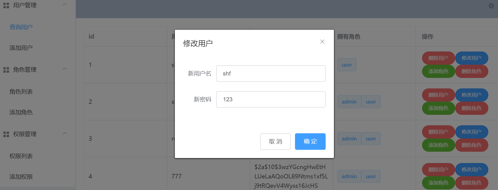

# vue_demo

一个简单的权限管理系统前端demo，用于学习vue与前后端分离 

对应后台服务地址：https://github.com/ekesaiting/vue_springboot_demo

# 背景

从零开始学习vue的写的一个demo，非常经典的三级权限管理,帮助快速后端开发者快速掌握Vue的基本使用，此页面我经过三次迭代，从最开始的jsp到使用thymeleaf,再到vue,界面虽越来越简陋，但web开发的思维从学校的原始教学中逐渐过渡到主流的现代开发

# 使用的技术与框架

**Vue+Element ui+axios**

# 效果展示

修改用户信息

添加角色：

角色列表

